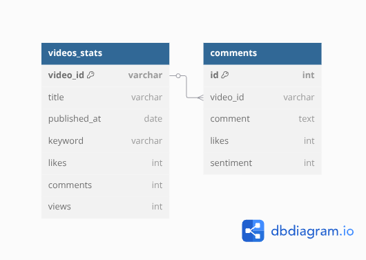

# YouTube Comments & Popularity Analysis
My goal is to uncover what kinds of videos drive more engagement, what comment patterns appear for high-performing videos, and how sentiment relates to popularity. These insights are geared towards content creators or platform strategists.

# Dataset and Schema
[`Data Source`](https://www.kaggle.com/datasets/advaypatil/youtube-statistics/data)
* Video-stats table -  This file contains some basic information about each video, such as the title, likes, views, keyword, and comment count.
* For each video in videos-stats.csv, comments.csv contains the top ten most relevant comments as well as said comments' sentiments and likes

## Column Descriptions
videos-stats.csv:

* Title: Video Title.
* Video ID: The Video Identifier.
* Published At: The date the video was published in YYYY-MM-DD.
* Keyword: The keyword associated with the video.
* Likes: The number of likes the video received. If this value is -1, the likes are not publicly visible.
* Comments: The number of comments the video has. If this value is -1, the video creator has disabled comments.
* Views: The number of views the video got.

comments.csv:

* Video ID: The Video Identifier.
* Comment: The comment text.
* Likes: The number of likes the comment received.
* Sentiment: The sentiment of the comment. A value of 0 represents a negative sentiment, while values of 1 or 2 represent neutral and positive sentiments respectively.

## Data Schema

> The videos_stats and comments tables are related through a one-to-many relationship: Each video in the videos_stats table can have multiple comments in the comments table. This relationship is established via the video_id, which is a primary key in videos_stats and a foreign key in comments.

# Business Questions
1. Which keywords are associated with the highest-performing videos?

2. Do videos with high engagement (likes/views/comments) tend to have more positive, negative, or neutral comments?

3. Use average sentiment across comments per video.

4. Which videos have the most liked comments, and what is the sentiment of those top comments?

5. What proportion of videos have disabled comments or hidden like counts?

6. Are there keywords that consistently result in higher comment sentiment or more liked comments?

7. How does the publication date relate to performance?

